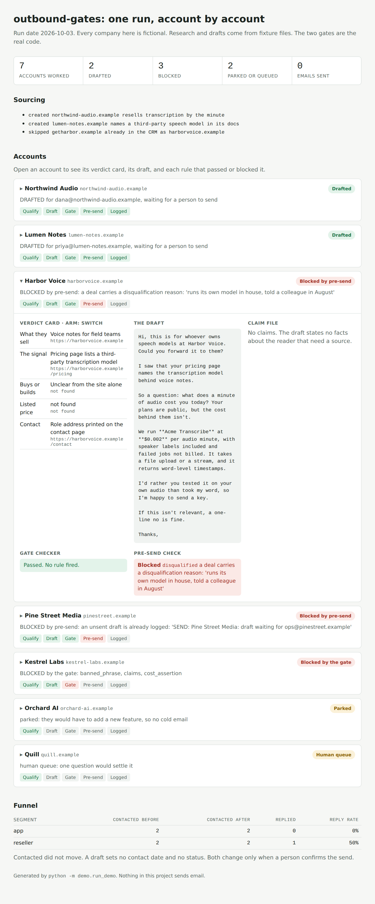

# outbound-gates

A small, opinionated system for running AI-assisted outbound without sending anything untrue.

A language model writes a plausible cold email in seconds. The hard part is everything around it: finding the right company, proving each fact, not emailing someone twice, and keeping the CRM honest. This repo holds the parts that do that work.

Everything here uses a fictional product, **Acme Transcribe**, a speech-to-text API priced at $0.002 per audio minute. Every company and domain in the examples is invented. Swap in your own product, prices and rules.

## Try it in one minute

Python 3.9 or newer. No packages to install.

```
git clone <this repo> && cd outbound-gates
python -m demo.run_demo
```

The demo takes seven accounts through the whole pipeline against a mock CRM and prints where each one ends:

```
Source
  created  northwind-audio.example    resells transcription by the minute
  created  lumen-notes.example        names a third-party speech model in its docs
  skipped  getharbor.example          already in the CRM as harborvoice.example

Qualify, draft, gate, pre-send
  harborvoice.example        BLOCKED by pre-send: a deal carries a disqualification reason: ...
  pinestreet.example         BLOCKED by pre-send: an unsent draft is already logged: ...
  kestrel-labs.example       BLOCKED by the gate: banned_phrase, claims, cost_assertion
  orchard-ai.example         parked: they would have to add a new feature, so no cold email
  quill.example              human queue: one question would settle it
  northwind-audio.example    DRAFTED for dana@northwind-audio.example, waiting for a person to send
  lumen-notes.example        DRAFTED for priya@lumen-notes.example, waiting for a person to send
```

It also writes a visual report to `demo/out/report.html`. Open it in a browser to see each account's verdict card, its draft, and the exact rule that passed or blocked it. The page needs no server and loads nothing from the network.



The terminal output then shows the funnel before and after. The contacted count does not move, because a draft is not a send. Add `--confirm-send northwind-audio.example` to see what a confirmed send changes.

## What runs and what is a procedure

| Part | Status |
|---|---|
| `gates/checker.py` | Runs. Checks a draft against mechanical rules |
| `gates/presend.py` | Runs. Checks an account against CRM history |
| `gates/funnel.py` | Runs. Recounts the funnel from a CRM export |
| `demo/` | Runs. The pipeline end to end on a mock CRM, offline, with an HTML report of the run |
| `skills/` | Procedures. Four instruction files an AI agent follows for sourcing, qualifying, drafting and checking |
| A CRM or mail connector | Not included. See `docs/crm-adapter.md` for the data shape to supply |

In the demo, research and drafting are read from fixture files so it needs no API key and gives the same result every time. In real use an agent does those two steps by following the skills. The gates are the same code either way.

Nothing in this repo sends email. A person sends every one.

## How the pieces fit

```
source  ->  qualify  ->  draft  ->  gate checker  ->  pre-send check  ->  human sends
 (wide)    (verdict     (claim       (blocks on         (blocks on
            card with    file per     mechanical         CRM history)
            URLs)        draft)       rules)
```

Each step writes to the CRM before the next one starts. `examples/walkthrough/` shows what every step leaves behind for one account.

## What's in it

| Path | What it is |
|---|---|
| `gates/checker.py` | The draft gate: length, banned phrases, dashes, unsourced numbers, cost assertions |
| `gates/presend.py` | The account gate: disqualified, already contacted, draft waiting, promise made, replied |
| `gates/funnel.py` | Contacted, replied and stage counts by segment |
| `demo/` | Mock CRM, candidate list, account fixtures, the runner and the report builder |
| `skills/` | Four agent skills: source, qualify, draft and pre-send check |
| `docs/crm-model.md` | The CRM conventions the skills write to |
| `docs/crm-adapter.md` | The data shape the gates read, and how it maps onto HubSpot |
| `docs/capabilities.md` | What a draft is allowed to claim about the product |
| `docs/human-queue.md` | Where unclear accounts go and how they are cleared |
| `docs/funnel-definitions.md` | Definitions that make the funnel recountable |
| `examples/` | A passing draft, a failing draft, a claim file and the walkthrough |

## The gate checker

```
python -m gates examples/draft_pass.txt \
  --config gates/config.example.json --register cold --claims examples/claims.json
```

It exits 0 on a pass, 1 on a block and 2 when an input is wrong, such as a missing file or an unknown register. That makes it safe to use in a script or a pipeline.

Curly quotes and Windows line endings are flattened before the rules run, so a draft pasted from a mail client is checked the same way as plain text.

| Rule | What it blocks |
|---|---|
| `dashes` | Em dashes, en dashes, and more spaced hyphens than the config allows |
| `length` | A word count outside the range for the register |
| `sign_off` | A missing or wrong sign-off |
| `required_close` | A cold email without the fixed closing line |
| `banned_phrase` | Any phrase on the banned list |
| `bold` | Bold text that is not the product name or a price |
| `cost_assertion` | A sentence that states what the reader pays. Asking is allowed |
| `claims` | A number in the draft with no sourced claim behind it, or a claim with no URL |
| `rhythm` | Warns on few contractions or three same-length sentences in a row |

The `claims` rule matters most. Every number in an email must appear in that draft's claim file with a URL and the date it was checked. A claim older than the configured age produces a warning. Numbers you derive from a sourced value, such as a margin, are listed under that claim's `derived` field.

Clock times, calendar dates and anything inside a URL are not treated as claims. A year is. Set `number_ignore_patterns` in the config to change what is skipped.

## The pre-send check

```
python -m gates.presend --crm demo/mock_crm.json \
  --domain harborvoice.example --contact ops@harborvoice.example
```

| Rule | What it blocks |
|---|---|
| `disqualified` | An unqualified status, a deal with a disqualification reason, or a `DQ` or `DO NOT EMAIL` note |
| `contacted` | A `SENT` note to the same address |
| `draft_waiting` | An open `SEND` task, meaning a draft already exists |
| `promise` | A `PROMISE` note, such as a commitment not to write again |
| `replied` | A reply date, because the next message belongs on that thread |
| `unknown_company` | A domain with no company record |
| `colleague_contacted` | Warns when someone else at the company was emailed in the last 7 days |

Every run ends by stating what the check cannot see: calls, social messages, and sends from mailboxes that do not log to the CRM.

## Why each rule exists

Each rule exists because the failure it prevents is easy to make with a model in the loop.

- **Invented facts.** A model will state a headcount, a funding round or a price with full confidence. The claim file forces a URL behind every number.
- **Stale facts.** A price that was true a month ago goes out in a follow-up. Claims carry a checked date.
- **Stating what the reader pays.** You can verify what a company lists. You cannot know what it pays, and the first technical reply will say so.
- **Double drafting.** A run that drafts ten emails and logs them at the end will, if interrupted, draft the same ten tomorrow. Each draft is logged before the next begins.
- **Emailing a disqualified account.** A check that only reads email history misses a disqualification recorded on a deal. The pre-send check reads status, deals and notes first.
- **Counting drafts as sends.** Status moves when a person confirms the send, never when a draft is created.

## Install as a plugin

The repository is a Claude plugin. Python 3.9 or later must be on the machine, and nothing else needs installing.

In Claude Code:

```
/plugin marketplace add howardhwt/outbound-gates
/plugin install outbound-gates@outbound-gates
```

In Claude Cowork, open the packaged `outbound-gates.plugin` file and accept it.

Four skills load: `source`, `qualify`, `draft` and `presend-check`. The `draft` and `presend-check` skills call the bundled checker by its installed path, so they work from any folder. Your drafts, claim files and CRM export stay in your own working folder.

The skills ship with `gates/config.example.json`. Copy it, change the rules to your own, and pass your copy with `--config`.

## Adapting it

1. Copy `gates/config.example.json` and set your registers, banned phrases and bold allow list.
2. Put your own product's facts in `own_facts` and in `docs/capabilities.md`.
3. Rewrite the arms in `skills/qualify` for how your buyers differ.
4. Map the statuses and keywords in `docs/crm-model.md` onto your CRM, and build the export described in `docs/crm-adapter.md`.

## Tests

```
pip install -r requirements-dev.txt
python -m pytest
```

The tests cover both gates, the demo's outcome for every account, the walkthrough files, and the awkward inputs real tools produce: curly quotes, Windows line endings, dates, URLs, malformed files and messy CRM exports. They pass on Python 3.9 through 3.13.

## Known limits

- The `cost_assertion` rule matches phrases, so a harmless sentence containing "you pay" is blocked too. It also treats a question as an assertion if the sentence contains an abbreviation with a full stop, such as "e.g.". Reword the sentence or adjust the patterns in the config.
- A number written in a different unit from its claim, such as 0.6 cents for $0.006, is not matched. List it under the claim's `derived` field.
- The pre-send check sees promises and replies only when they are recorded in the CRM. Reading earlier emails for tone and repeated openings still needs a person or an agent.
- The funnel groups by segment. Add your own grouping if you run more than one lane.

## License

MIT
